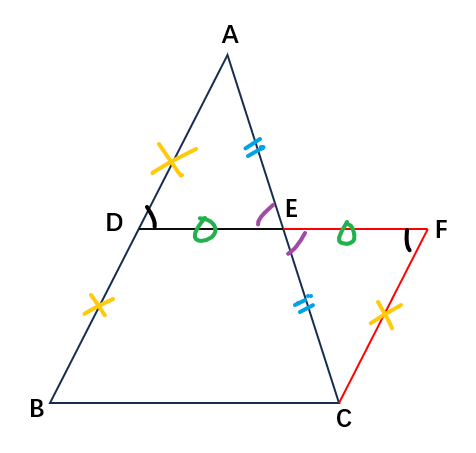

# 初中数学

[TOC]

## 第一章 有理数

### 1.1 正数和负数

1. 正数：大于0的数。正号省略。

2. 负数：小于0的数。标记负号。

3. 0：既不是正数，也不是负数。

   意义：无、不存在、正负边界。

4. 正负：表示**相反**的意义，标准可以自定义。

### 1.2 有理数

1. 整数：正整数，0，负整数。

2. 分数：正分数，负分数。

   $\frac{4}{2}$​ 还是整数，只是以分数的**形式**表达。

3. 有理数：有道理（规律）可循的数。（整数，有限小数，无限循环小数）

   **无理数**：无道理（规律）可循的数。（$\pi$、$\sqrt{2}$​、1.345681639…，**无限不循环小数**）

4. 自然数：大于0的整数。（自然界中存在的数量抽象）

5. 数轴：一条上面标数的轴。（直线、正方向、原点0、单位长度）

6. 相反数：符号不同、数值相同的两个数，互为相反数。

7. 绝对值：长度、距离。（绝对即不变，相对即根据参照物不同结论会有不同）

   标记符号：$|a|$​。

8. 比较大小：数轴右边的比左边的大，绝对值就比到原点的距离。

### 1.3 有理数的加减法

1. 减法：小的数减大的数，结果一定是负数，再算个绝对值就行了。

2. 减去一个数，等于加这个数的相反数：
   - 减去一个正数，相等于往回捯。

     加一个负数，加相当于向前进，但是负数改反了方向，最后也是往回捯。

   - 减负数，加正数，方向，同理。

3. 除法可以通过引入分数统统转换为乘法。

   减法可以通过引入负数统统转换为加法。

   乘法最终可统一为多次加法。

### 1.4 有理数的乘除法

1. [**负负得正**](https://www.bilibili.com/video/BV1UK421a7H4)：负数代表取反，而正负只有两个方向，取两次反相当于没变。
2. $a$与$\frac{1}{a}$互为倒数。$\frac{b}{a}$与$\frac{a}{b}$​互为倒数。（注意：分母不能等于0）
3. 拆括号的时候，不要忘记变号。

### 1.5 有理数的乘方

1. 乘方：自己乘自己，乘几次就叫几次方，其中2次方还叫平方，3次方还叫立方。

   标记符号：$a^n$。

2. 幂：乘方的结果。（杨幂名字的来源）

   其中，$a$​叫底数。（因为在底下就叫底数）

   $^n$​​叫指数。（因为指头都是往上指，指的那个数就叫指数）

3. 负数的奇次幂还是负数，偶次幂变成正数。（因为负负得正，成对出现就抵消了）

4. 科学记数法：科学计算中会用到超大的数字，为了便于记录和比较大小（数量级），在记数的时候，只取第一位有效数字，后面的位数全部放到小数点以后，最后用乘以$10^n$的形式补齐数量级。

## 第二章 整式的加减

### 2.1 整式

1. 单项式：“粘”在一块的项式。

2. 系数：单项式中（字母以外的）数字的乘积（注意化到最简）。

   系数都是常数，一般写在最前，像“牵着”（系着）后面的字母项式一样。

3. 多项式：用加减号组合连接的一堆单项式。

4. 整式：单项式和多项式。

   分式：带分号的表达式。

5. 常数项：多项式中的单独常数部分。

### 2.2 整式的加减

1. 同类项：有相同的“根儿”（字母）的项。
2. 合并同类项：提取公因式。
3. 提负号的时候，括号里不要忘记变号。

## 第三章 一元一次方程

### 3.1 从算式到方程

1. 方程：含有**未知数**的**等式**。

2. 元：未知数。

3. 次：未知数的**最高**次数。

4. a元b次方程：含有a个未知数，且未知数的**最高**次数为b次的方程。

5. 解（根）：使方程成立的未知数的取值。

6. 等式的性质：左右加减同样的量，或放缩同样的倍数，等式仍成立。

   启发：利用这个性质，可以凑完全平方公式。

### 3.2 解一元一次方程（一）—— 合并同类项与移项

1. 移项：将项从等式的一边移到另一边。移项要变号！

### 3.3 解一元一次方程（二）—— 去括号与去分母

1. 去分母：分式方程，交叉相乘。

   注意：分子不写括号，但是意义上是一个整体，相当于自带括号，一定要整体相乘。

### 3.4 实际问题与一元一次方程

1. 解题思路：**翻译题干**，**找等量关系**。

   注意：有的时候不会直接告诉你**“谁和谁相等”**，而是有**隐藏的等量关系**（“总共花了……”）。

2. 设未知数：

   - 带比例的，按比例关系设未知数。（最后解出$x$后，不要忘记乘回去）
   - 谁比谁多，设数量小的，加成另一个。

3. 找思路时，如果一个未知数不够，就设两个。

   两个不够就设三个……往往最后都能消掉。

   最忌讳的就是原地不动没有任何进展地思考该设谁做未知数。

## 第四章 几何图形初步

### 4.1 几何图形

1. 立体图形：都可以理解成底面积和高的组合。
2. 平面图形：只有长宽没有高。

### 4.2 直线、射线、线段

1. 直线：两点确定一条直线，且两端可以无限延伸。
2. 射线：只有一端可以无限延伸。
3. 线段：两点的连线，长度确定。
4. 两点之间，线段最短。（应用：最短路径问题，“将军饮马问题”）

### 4.3 角

1. 角：一个点，射出两条边，形成角度。

   标记符号：$\ang1,\ang{A}$。

2. 角的分类：

   - 直角=90°，锐角<90°，钝角>90°。
   - 平角=180°，周角=360°。

3. 角平分线：从角的顶点出发，平分角度的射线。

   （角平分线的定义，也是角平分线的判定）

4. 余角：照90°剩**余**的部分。

5. 补角：照180°要**补**的部分。

## 第五章 相交线与平行线

### 5.1 相交线

1. 邻补角：相邻、互补成180°的角。

2. 对顶角：相对、互相顶着的角。

3. **公理**：不证自明，各学科领域中那些“认同就一起玩儿，不认同就滚蛋”的基本原则。

   **定理**：基于公理的逻辑推导，形成的一系列比较好用的二级、三级结论。

4. **性质：是什么$\rightarrow$​能干什么**。（首先它是什么，然后才有什么性质）

   - 对顶角相等：首先**是**对顶角，一旦我知道他俩是对顶角，我就知道他俩相等。

   **判定：能干什么$\rightarrow$是什么**。（首先它有什么性质，然后判定它是什么）

   - 图形的两组对边分别平行则判定该图形是平行四边形：

     首先我知道这个图形**能**满足两组对边分别平行，然后我立刻就知道它是平行四边形。

   > 性质与判定，常用于在读题的过程中迅速反应**隐藏条件**。

5. 对顶角的性质：对顶角相等。

   （证明：同角的补角相等）

6. 垂线：垂直线。标记符号：$\perp$。

   垂足：落脚点。标记符号： 。

7. 垂线段的性质1（垂线段唯一性定理）：过一点**只能做一条**已知直线的垂线段。

   （证明：略，感兴趣问 DeepSeek）

8. 垂线段的性质2：垂线段**最短**。

   （证明：略，感兴趣问 DeepSeek）

9. 点到直线的距离：垂线段的长度。

   距离在数学上一般指最短距离，与后期“角平分线上的点到角两边的**距离**相等”呼应。

10. 同位角：一组平行线，被直线切割，处于**直线和平行线同侧位置**的两个角。

    （精确的同位角定义是不限制平行的，这里的同位角实际上是一种特殊的平行同位角）

11. 内错角：一组平行线，被直线切割，处于**平行线内部交错**的两个角。

12. 同旁内角：一组平行线，被直线切割，处于**直线同侧，互为旁侧，平行线内部**的两个角。

### 5.2 平行线及其判定

1. 平行：不相交的两条直线平行。

2. 平行线唯一性公理：过直线外一点，有且只有一条直线与之平行。

3. 直线平移平行定理：平行于同一直线的两条直线平行。

4. 平行线的判定1：同位角相等，两直线平行。

5. 平行线的判定2：内错角相等，两直线平行。

6. 平行线的判定3：同旁内角互补，两直线平行。

   > 三个判定，本质同一，可灵活转换。

### 5.3 平行线的性质

1. 平行线的性质1：两直线平行，同位角相等。

2. 平行线的性质2：两直线平行，内错角相等。

3. 平行线的性质3：两直线平行，同旁内角互补。

   > 三个性质，本质同一，可灵活转换。

4. 命题：下判断、下结论。

   真命题：判断成立。

   假命题：判断不成立。

5. 证明：基于一些命题（已知条件、前提条件），通过严密的逻辑推导，形成新的真命题（定理、结论）的过程。

   （基于假命题进行的反证法，本质上也是一种证明，更好的说法是证伪）

### 5.4 平移

1. 平移：不局限于平面，也可以在空间中，平是直线轨迹的意思，即不弯曲（平移不是漂移）。

2. 思维方法：从反面想问题，想要认识一个东西是什么，如果正面理解不了，就尝试思考一下它不是什么。

3. 抽象：基于多个个体抽出像的部分（共同点）。“你绝没有吃过水果”。

   具象：一个个拥有自身特质内容的个体。

## 第六章 实数

### 6.1 平方根

1. 乘方根：一个数乘$n$次方得到一个结果，这个数就叫这个结果的$n$​次方根。（根，开枝散叶）

   特殊的，2次方根也叫平方根，3次方根也叫立方根。

   标记符号：$\sqrt{a}, \sqrt[3]{a}, \sqrt[n]{a}$。（根号$a$，3次根号$a$，$n$次根号$a$）

2. 算术平方根（主根）：一个数的平方根一般有两个，取正的那个作为主根（没必要取负的当主根），同时规定0的主根就是0。算术平方根实际上是英文原语“**arithmetic**”的日语错译，英语本义是“主要的、基本的”，应该翻译为“主根”更合适。

   > **arithmetic** 本义确实是“算术（加减乘除）”的意思，因为算术是数学中的基础的基础，引申为“主要的、基本的”含义。

3. 开方：开几次方，就是求几次方根。（开方就是乘方的逆运算）

   特殊的，开2次方也叫开平方，开3次方也叫开立方。

### 6.2 立方根

1. 略。

### 6.3 实数

1. 无理数：无限不循环小数。
2. 实数：有理数和无理数。

## 第七章 平面直角坐标系

### 7.1 平面直角坐标系

1. 数对：一对儿数。

   有序：有顺序。（不是无序）

   有序数对：有顺序的一对儿数。

   标记符号：$(a,b)$​。

2. 平面直角坐标系：两条数轴，互相垂直，组成的能锚定一系列点的坐标的框架。

   （“数形结合”，代数和几何统一了，意义非凡）

3. 坐标：$(x,y)$。

4. 象限：四个象限（“两仪生四象”），对应第1、2、3、4象限。

   因为都是正数的话比较方便，所以定了右上角为第一象限，然后逆时针旋转。

   （“神交古人”，去尝试理解古人面对的困境和问题，从而领会他们如此制定规则的用意和无奈）

### 7.2 坐标方法的简单应用

1. 用坐标表示地理位置：$(经度,纬度)$。
2. 用坐标表示平移：水平改$x$，竖直改$y$。

## 第八章 二元一次方程组

### 8.1 二元一次方程组

1. 方程组：一组方程，方程的组。

   （有几个未知数，至少需要几个方程，才能有**唯一**确定的解）

2. 方程组的解：使方程组内每个方程都成立的未知数的取值。

### 8.2 消元 —— 解二元一次方程组

1. 消元：消掉未知数。

2. 解方程组：**先加减，求出一个未知数，再代入，求出剩余未知数**。

   （未知数不是整数倍的情况下，尝试凑最小公倍数）

### 8.3 实际问题与二元一次方程组

1. 略。

### 8.4 三元一次方程组的解法

1. 解法：三元消成二元，二元消成一元，逐级返回代入。

## 第九章 不等式与不等式组

### 9.1 不等式

1. 不等式：左右不相等的式子。

2. 可以连接不等式的符号：

   - 大于号：$>$
   - 小于号：$<$
   - 大于等于号：$\ge$
   - 小于等于号：$\le$
   - 不等号：$\ne$​​

   > 在数轴上标记时，**包含等于（能取到）**的位置画实心点，**不包含等于（取不到）**的位置画空心圆。

3. 不等式的解：使不等式成立的未知数的值。

4. 不等式的解集：不等式的解的集合。

   （一般是一个范围，使用不等式的符号框定，左小右大连在一起，或者各自分开）

5. 不等式的性质1：左右加减同样的量，不等式仍成立。

6. 不等式的性质2：左右放缩同样的正倍数，不等式仍成立。

7. **不等式的性质3**：左右放缩同样的**负倍数**，不等式**符号方向调换**。

### 9.2 一元一次不等式

1. 略。

### 9.3 一元一次不等式组

1. 一元一次不等式组：一组一元一次不等式。

   （一元一次不等式之所以能够形成组，是因为可以通过不同的不等式，框定一个交集的范围）

## 第十章 数据的收集、整理与描述

### 10.1 统计调查

1. 全面调查：普查。（人口普查、全民核酸）
2. 抽样调查：样本。（“想要了解这锅汤的味道”）
3. 简单随机抽样：机会均等。

### 10.2 直方图

1. 直方图（柱状图）：在一定的**组距**下，合计该组样本的数量，画成直上直下的带一定宽度的方形图。
2. 折线图：将一些数据的散点连成线。

## 第十一章 三角形

### 11.1 与三角形有关的线段

1. 三角形：三条线段首尾顺次相接。标记符号：$\triangle$。

2. 三角形分类：

   - 直角三角形：有一个角是直角。标记符号：$Rt\triangle$。（Right triangle，直角三角形）

     锐角三角形：**三个角都是锐角**。

     钝角三角形：有一个角是钝角。

   - 普通三角形：三边不等。

     等腰三角形：有两边等。（特殊的三角形）

     等边三角形（正三角形）：三边都等。（特殊的等腰三角形）

3. 顶角：顶上的角。

   底角：底下的角。

4. 三角形的性质：三角形任意两边之和大于第三边。

   （通过对不等式移项，其实还可以知道，两边之差小于第三边）

5. 高：三角形顶点到对边的**垂线段**。（顶点到对边的距离）

6. 中线：三角形顶点与**对边中点**的连线。

   重心：**中线**的交点。

7. 角平分线：角内部平分角的射线。

8. 关于三角形的常识：三角形具有稳定性。

### 11.2 与三角形有关的角

1. 三角形的内角：三角形内部的角。

2. 三角形的外角：三角形内角的**邻补角**。

3. 三角形内角和定理：三角形内角和等于180°。

   （证明：底边向上平移过顶点，利用内错角和顶角凑成平角）

4. 互**余**：两个角之和等于90°。

   互**补**：两个角之和等于180°。

5. 直角三角形的性质：直角三角形的两个锐角互余。

   （证明：三角形内角和180°，一个角是直角90°，则剩余两个角必为锐角，且角度和必为90°）

6. 直角三角形的判定：有两个角互余的三角形是直角三角形。

7. 三角形外角的性质：三角形的外角等于与它不相邻的两个内角的和。

   （换言之，相邻两个内角的和等于第三个角的外角）

   （证明：通过三角形内角和定理和邻补角的定义）

8. 三角形外角和定理：三角形的外角和等于360°。

   （证明：通过三组邻补角和一组内角和叠加移项）

   （直观：三个角度和，相等于从外面围着转了一圈，一圈就是一周，周角）

### 11.3 多边形及其内角和

1. 多边形：多条线段首尾顺次相接。

2. 正多边形：各边（角）相等的多边形。

   （所以，正三角形也可以叫做正三边形）

3. 对角线：两个不相邻顶点间的连线。

   （所以，三角形没有对角线）

4. 多边形内角和定理：$(n-2)\times{180°}$​

   （证明：基于一个顶点，能做出的对角线数，因为要减掉与该顶点相邻的2个顶点和自身，所以只能做出<small>$(n-3)$</small>条对角线。内部能做出<small>$(n-3)$</small>条对角线，就像切蛋糕，最后总要剩1块，所以能将多边形内部切成<small>$(n-2)$</small>个三角形，每个三角形内角和是180°）

5. 多边形外角和定理：多边形的外角和等于360°。

   （直观：不管拐几次，总归是绕一圈，所以永远是360°）

## 第十二章 全等三角形

### 12.1 全等三角形

1. 全等：完全重合。

2. 全等三角形：完全重合的两个三角形。（对应角、对应边、对应顶点）

   标记符号：。

3. 全等三角形的性质：全等三角形的对应边相等、对应角相等。

### 12.2 三角形全等的判定

1. 证三角形全等（全等三角形的判定）：

   - **5种正确方法**：**SSS、HL、SAS、ASA、AAS**
   - <b style="color:red;">1种错误方法</b>：<b style="color:red;">SSA</b>

    

   > **SSA**：“边边角”不好使！
   >
   >  

2. 证直角三角形全等时，不要迂腐！

   不要一定要用 **HL** 去证，因为已经有一个直角了，用其他**带“角”的**方法证明亦可。

### 12.3 角的平分线的性质

1. 角平分线的性质（角平分线定理）：角平分线上的点到角两边的距离相等。

   （证明：距离代表垂直构造两个直角，角平分线构造两个相等的角，再加一条公共边，AAS）

2. **化归**（化难为易）：将困难的、还不会的问题A，转化归结为简单的、已经会的问题B，通过解决问题B，最终解决问题A。

   > **例如：你现在只会救火，就是说着火了你会救，不着火不知道怎么做。那么，现在有一堆柴火正在冒烟（还没着火），你该怎么办？所谓化归的思想，就是“想办法先把冒烟的柴火点着，然后再灭火！”**

    

3. 判定点在角平分线上（角平分线定理的逆定理）：角内部到角两边距离相等的点在角平分线上。

   （证明：距离代表垂直，也就是$Rt\triangle$​，距离还相等，连接顶点和内部该点，转化为证明该直线为角平分线，转化为证明该直线分割的两个角相等，转化为证全等，公共边，HL）

## 第十三章 轴对称

### 13.1 轴对称

1. 轴对称（翻转）：关于对称轴完全重合。

2. **线段**垂直平分线：过线段中点做的垂线。

3. 线段垂直平分线的性质（线段垂直平分线定理）：线段垂直平分线上的点到线段两端点的距离相等。

   （证明：SAS）

4. 判定点在线段垂直平分线上（线段垂直平分线定理的逆定理）：到线段两端点距离相等的点在这条线段的垂直平分线上。

   （证明：画线段，找外一点，连接两个端点。

   - 方法一：做中线，用SSS证全等，进而证直角，证垂直。
   - 方法二：做垂线，用HL证全等，进而证中点，证平分。）

### 13.2 画轴对称图形

1. 略。

### 13.3 等腰三角形

1. 等腰三角形的性质1：等腰三角形的两底角相等。（“等边对等角”）

   （证明：做顶角平分线，或底边中线，或底边高，证全等）

2. 等腰三角形的性质2：等腰三角形的顶角平分线、底边中线、底边高重合。（“三线合一”）

   （证明：先做一条线，再证明这条线是另外两条线即可，最终仍然化归为证全等）

3. 等腰三角形的判定：有两个角相等的三角形是等腰三角形。（“等角对等边”）

   （证明：做顶角平分线，<del>或底边中线</del>，或底边高，证全等）

4. 辅助线的描述：

   - 过……作……交……于……

     作……的……

     延长……交……于……

   - ……：谁谁的高，谁谁的角平分线，谁谁的中线，谁谁的延长线

5. 等边三角形的性质：等边三角形的三个内角都相等，且都等于60度。

   （证明：等腰三角形，“等边对等角”，转个60°，继续套用，三个角连等）

6. 等边三角形的判定1：三个角都相等的三角形是等边三角形。（“等角对等边”）

   （证明：利用等腰三角形的判定去证）

7. 等边三角形的判定2：有一个角是60°的等腰三角形是等边三角形。（“等腰60度等边”）

   （证明：分情况讨论，分60°角是顶角还是底角）

8. $\sin{30\degree}=\frac{1}{2}$​：在直角三角形中，30°角所对的直角边等于斜边的一半儿。

   （证明：将三角形轴对称，补成一个大的等边三角形，剩下的自己想）

### 13.4 课题学习 最短路径问题

1. 两点之间，线段最短。（应用：最短路径问题，“将军饮马问题”）

## 第十四章 整式的乘法与因式分解

### 14.1 整式的乘法

1. 同底数幂的乘法：$a^m·a^n=a^{m+n}$

   （原理：m个a相乘，再乘以，n个a相乘，最终合成m+n个a相乘，即a自己乘自己乘了m+n次）

2. 幂的乘方：$(a^m)^n=a^{mn}$​

   （原理：n个（m个a相乘的结果）相乘，最终合成nxm个a相乘，即a自己乘自己乘了mn次）

3. 积的乘方：$(ab)^n=a^nb^n$​

   （原理：乘法交换律）

4. 整式的乘法：常数乘常数，字母乘字母，指数该变变。

5. 同底数幂的除法：$\frac{a^m}{a^n}=a^{m-n}$​

   特殊的，$\frac{a^m}{a^m}=a^0=1$，但是，因为$\frac{0^m}{0^m}$出现了分母等于0的情况，所以$0^0$​不存在。

6. 负指数幂的运算：$\frac{a^0}{a^n}=a^{-n}=\frac{1}{a^n}$​

### 14.2 乘法公式

1. 平方差公式：
   $$
   a^2-b^2=(a+b)(a-b)\\
   (a+b)(a-b)=a^2-b^2
   $$

2. 完全平方公式：

   $$
   (a+b)^2=a^2+2ab+b^2\\
   (a-b)^2=a^2-2ab+b^2
   $$

### 14.3 因式分解

1. 因数：$因数\times因数=积$

2. 因式：用来相乘的整式。

3. 因式分解：将一个多项式分解为多个因式相乘的过程。

4. 公因式：同类项。

5. 提取公因式：将公因式提取出来，放到括号前面，逆用乘法分配律。

6. 因式分解的方法：提取公因式，配合逆用乘法公式。

   $$
   a^2-b^2=(a+b)(a-b)
   $$

   $$
   a^2+2ab+b^2=(a+b)(a+b)=(a+b)^2\\
   a^2-2ab+b^2=(a-b)(a-b)=(a-b)^2
   $$

7. 因式分解是整式乘法的逆运算。（反之亦然）

   > **逆运算**：
   >
   > （1）加减
   >
   > （2）乘除
   >
   > （3）乘方、开方
   >
   > （4）因式分解、整式乘法
   >
   > （5^*^）性质、判定

## 第十五章 分式

### 15.1 分式

1. 分式：带分号的表达式。（分子分母都是整式）

   > 整式包含整数，分式也包含分数。

### 15.2 分式的运算

1. 分式的乘方：$(\frac{b}{a})^n=\frac{b^n}{a^n}$​

### 15.3 分式方程

1. 分式方程：**分母**中含有未知数的方程。
2. 解分式方程：方程左右化成单一分式，然后交叉相乘，解整式方程，最后代入验证确保原分式方程中各项的分母不能为0（<b style="color:red;">否则就是无效解</b>）。

## 第十六章 二次根式

### 16.1 二次根式

1. 二次根式：$\sqrt{a}$（<b style="color:red;">$a\ge{0}$​，二次根号下，大于等于0</b>）。

2. 开方（开根号）与乘方是逆运算：
   $$
   (\sqrt{a})^2=a\\
   \sqrt{a^2}=a\\
   \textcolor{red}{(a\ge 0)}
   $$

### 16.2 二次根式的乘除

1. 二次根式的乘法：$\sqrt{a}·\sqrt{b}=\sqrt{ab}$。
2. 二次根式的除法：$\frac{\sqrt{a}}{\sqrt{b}}=\sqrt{\frac{a}{b}}$（<b style="color:red;">$b\gt{0}$</b>）。
3. 二次根式的化简：**通分使分母不带根式，分子根式能开尽开，上下约分**！（化简完，形成最简二次根式）

### 16.3 二次根式的加减

1. 二次根式的加减：化成最简二次根式加减。

## 第十七章 勾股定理

### 17.1 勾股定理

1. 直角三角形三边的性质（勾股定理）：$a^2+b^2=c^2$。

   （证明：赵爽弦图，国际数学家大会会徽）

2. 常用勾股数：

   - 3, 4, 5
   - 5, 12, 13

### 17.2 勾股定理的逆定理

1. 直角三角形的判定（勾股定理的逆定理）：如果三角形的三边长满足$a^2+b^2=c^2$，则该三角形是直角三角形。

## 第十八章 平行四边形

### 18.1 平行四边形

1. 平行四边形：两组对边分别平行的四边形。

   > <b style="color:red;">定义本身是天然的判定，符合定义当然就可以判定为是这个东西。</b>

2. 平行四边形的性质1：平行四边形的对边相等，对角相等。

   （证明：拉对角线，ASA，证全等）

3. 平行四边形的性质2：平行四边形的对角线互相平分。

   （证明：拉两条对角线，AAS，证全等）

4. 两条平行线之间的距离：一条直线上的**点到**另一条**直线的距离**。

5. 平行四边形的判定1.1：两组**对边**分别**相等**的四边形是平行四边形。

   平行四边形的判定1.2：两组**对角**分别**相等**的四边形是平行四边形。

6. 平行四边形的判定2：**对角线互相平分**的四边形是平行四边形。

7. 平行四边形的判定3：**一组对边平行且相等**的四边形是平行四边形。

8. 三角形中位线：连接三角形两边**中点**的线段。（中间位置的线）

9. 三角形中位线的性质（中位线定理）：三角形的中位线平行于第三边，且等于第三边的一半。

   （证明：将中位线和底边纳入一个平行四边形，证一组对边平行且相等）

    

10. 三角形中位线的判定（中位线定理的逆定理）：三角形内平行于第三边，且等于第三边的一半的线段是三角形中位线。

    （证明：略）

### 18.2 特殊的平行四边形

1. 矩形：有一个角是直角的平行四边形。

   > 矩形是特殊的平行四边形，所以千万不要忘记，平行四边形该有的性质，矩形一样有！

2. 矩形的性质1：矩形的四个角都是直角。

   （证明：平行四边形对角相等，同旁内角互补）

3. 矩形的性质2：矩形的对角线相等。

   （证明：SAS）

4. 直角三角形的性质：**直角**三角形**斜边**上的**中线**，等于**斜边**上的**一半**。

   （证明：利用过点作平行线的方法，构造一个矩形，利用矩形对角线相等，和平行四边形对角线互相平分的性质，以及对角线的交点是中点，进而得证）

5. 矩形的判定1：有**三个角是直角**的**四边形**是矩形。

   （证明：四边形内角和，两组对角分别相等推平行四边形，一个角是直角）

6. 矩形的判定2：**对角线相等**的**平行四边形**是矩形。

   （证明：SSS，同旁内角互补）

7. 菱形：有一组**邻边相等**的平行四边形。

8. 菱形的性质1：菱形的四条边都相等。

   （证明：平行四边形对边相等）

9. 菱形的性质2：菱形的两条对角线互相垂直，且平分对角。

   （证明：平行四边形对角线互相平分，SSS，平分平角证垂直，全等推角等，内错角推平分）

10. 菱形的判定1：四条边都相等的四边形是菱形。

    （证明：两组对边相等的四边形是平行四边形）

11. 菱形的判定2：对角线互相垂直的平行四边形是菱形。

    （证明：SAS，证内部相邻的两个三角形全等）

12. 正方形：有一个角是直角的**菱形**，或者有一组邻边相等的**矩形**。

## 第十九章 一次函数

### 19.1 函数

1. 量：容器。

2. 变量：值可以变的量。

3. 常量：值不可以变的量。（最终会写成一个常数，常数就是“死数”）

4. 函数：表达一个数随着另一个数的变化而变化的数。

   > 函，箱子，“乃遂盛樊於期之首，**函**封之”。理解为一个“黑箱子”，扔进去一个数，吐出来一个不同的数，然后理解这个“黑箱子”的构造（求函数解析式）。

5. 自变量：我们人为设定的可以自行引起变化的那个量，一般放在函数式的右边。

6. 因变量（函数值）：因为自变量的变化，导致联动变化的那个量，一般放在函数式的左边。

7. 元：自变量的个数。

8. 次：自变量的**最高**次数。

9. 解析式（表达式）：因变量随自变量变化而变化的规则，数学上可以通过一个代数式表达。

10. 求解析式的过程：确定解析式中常量的过程。

11. 求解析式的方法：待定系数法。

    （待定就是未知，我先设出来，然后代入相应的变量取值，解关于常量的方程组）

12. 函数的图像：在坐标系中将函数的变量匹配对应的轴，将所有可能的取值表示为散点，散点累积成图像（目前还只是线）。

13. 点在函数图像上：点的坐标可以代入函数解析式中成立。

### 19.2 一次函数

1. （一元、单自变量）一次函数：$y=kx+b$。（$\textcolor{red}{k\ne 0}$）

   - 变量：$x$，$y$​
   - 常量（系数）：$k$，$b$​

2. 一次函数的图像：直线。

   - $k$：<b style="color:red;">斜率</b>（倾斜程度）。

     直线才有斜率，两点确定一条直线，通过<b style="color:red;">$\frac{两点纵坐标的差}{两点横坐标的差}$</b>计算斜率的值，再比较大小。
     $$
     y_1=kx_1+b\\
     y_2=kx_2+b\\
     k=\frac{y_1-y_2}{x_1-x_2}=\frac{\Delta{y}}{\Delta{x}}
     $$

   - $b$：截距。

   所以，点$(0,b)$和$(-\frac{b}{k},0)$一定在一次函数图像上。

   > $-\frac{b}{k}$的推导：一次函数解析式中，令$y=0$，反解用$k$和$b$表示的$x$​的值。

3. 正比例函数：$b=0$的一次函数。

   > 所谓正比例，就是$y$与$x$成正比例，就是$y$与$x$“成倍数变化”。
   >
   > 故若想$y$与$x$成倍数变化，$b$就不能来**捣乱**，所以要让他消失。

4. 一次函数与方程的关系：

   $y=kx+b$叫一次函数。

   $kx+b=0$叫一元一次方程。

   他们关系就在于，解一元一次方程，就相当于让一次函数的$y=0$，求出函数图像与$x$轴交点的横坐标。

   交点的个数，也就是解的个数。

   > 函数中的“变量”与方程中的“元（未知数）”，虽然是不同的概念，但在确定的点（坐标）上能够互通。

5. 一次函数与不等式的关系：将不等式移项改写成：

   $kx+b\textcolor{red}{◻︎}0$​（<b style="color:red;">不等式的符号</b>右边为0）
   
   的形式，左边填上一个$y=$​，就可以利用一次函数（图像）的思维方式去理解解不等式的意义。

## 第二十章 数据的分析

### 20.1 数据的集中趋势

1. 平均数：$平均数=\frac{总量}{总份数}$​。
   $$
   平均数=数据_1\times\frac{1}{总份数}+数据_2\times\frac{1}{总份数}+……
   $$

2. 权：秤砣，份量，重量。

3. 加权平均数：根据数据的份量不同，依据其重量级，进行加和求平均数。
   $$
   加权平均数=数据_1\times\frac{权重_1}{总权重}+数据_2\times\frac{权重_2}{总权重}+……
   $$

4. 中位数：**排序**后的**中**间**位**置的**数**据。（偶数个取中间两数平均值，奇数个直接取中间位置的数）

5. 众数：出现次数最多的数。

### 20.2 数据的波动程度

1. 波动：数据与平均值的距离。（为计算方便，放弃绝对值的方式，而直接使用平方）

2. 一组数据的波动程度：该组数据的平均波动。

3. 方差：每组数据减去平均值的平方，加和，再求平均。
   $$
   \overline{x} = \frac{1}{n}[x_1 + x_2 + \cdots + x_n]\\
   s^2 = \frac{1}{n}[(x_1 - \overline{x})^2 + (x_2 - \overline{x})^2 + \cdots + (x_n - \overline{x})^2]
   $$

## 第二十一章 一元二次方程

### 21.1 一元二次方程

1. 一元二次方程：$ax^2+bx+c=0$（$a\ne 0$）。
2. 根（解）：使方程成立的未知数的取值。

### 21.2 解一元二次方程

1. 配方法：为公式法的推导铺路。

2. 公式法：<b style="color:red;">$x=\frac{-b\pm\sqrt{b^2-4ac}}{2a}$</b>（求根公式，推导过程：详见九上P9）

   注意事项：

   （1）$a\ne 0$​，也不可能等于0，否则就不是一元二次方程。

   （2）根据$\Delta=b^2-4ac$（根的判别式）的取值：

   - $\Delta>0$，两个不相等的解。
   - $\Delta=0$，两个相等的解，就是$-\frac{b}{2a}$。
   - $\Delta<0$​，无解。

3. 因式分解法：因式分解后，相乘等于0，即可知各因式均等于0。

4. 十字相乘法（因式分解最常用的方法）：

    

5. 根与系数的关系：

   （1）$x_1+x_2=\frac{-b+\sqrt{b^2-4ac}}{2a}+\frac{-b-\sqrt{b^2-4ac}}{2a}=\frac{-2b}{2a}=-\frac{b}{a}$

   （2）$x_1·x_2=\frac{-b+\sqrt{b^2-4ac}}{2a}\times\frac{-b-\sqrt{b^2-4ac}}{2a}=\frac{b^2-(b^2-4ac)}{4a^2}=\frac{4ac}{4a^2}=\frac{c}{a}$

### 21.3 实际问题与一元二次方程

1. 略。

## 第二十二章 二次函数

### 22.1 二次函数的图象和性质

1. 二次函数（抛物线）：$y=ax^2+bx+c$（$a\ne 0$）。

2. $y=ax^2$：

   - $a$：改变开口大小、方向。（$|a|$越大，口越窄）

3. $y=(x+b)^2+c$：

   - $b$：改变对称轴的位置。（“左加<b style="color:red;">右减</b>”）
   - $c$​：改变上下的位置。（“上加下减”）

4. $y=a(x\textcolor{red}{-}h)^2+k$：$a$代表开口，$x=h$代表对称轴，$k$​​代表截距。

   改成标准形式：$y=ax^2-2ahx+(ah^2+k)$​。

   因为$x=h$是对称轴，$-2ah=b$，所以，$x=h=-\frac{b}{2a}$。

5. 对称轴：$x=-\frac{b}{2a}$。

6. 二次函数的最值：即在对称轴处函数的取值。

   （开口向下，对称轴处取**最大值**）

   （开口向上，对称轴处取**最小值**）

7. 二次函数的最值公式：$y=a(-\frac{b}{2a})^2+b(-\frac{b}{2a})+c=\frac{4ac-b^2}{4a}$​。

### 22.2 二次函数与一元二次方程

1. $y=ax^2+bx+c$叫二次函数。

   $ax^2+bx+c=0$叫一元二次方程。

   他们关系就在于，解一元二次方程，就相当于让二次函数的$y=0$，求出函数图像与$x$轴交点的横坐标。

   交点的个数，也就是解的个数。

### 22.3 实际问题与二次函数

1. 计算二次函数在平移之后的新函数解析式：

   - 左右移动：本质就是在操作$x$，**查找替换$x$“左加右减”**。
   - 上下移动：本质就是在操作$y$​，**解析式整体“上加下减”**。

   例：$y=10x^2-6x+7$，向右移动8个单位，向下移动5个单位后：

   $y=10(x\textcolor{red}{−8})^2−6(x\textcolor{red}{−8})+7\textcolor{red}{-5}$
   $y=10(x^2−16x+64)−6x+48+2$
   $y=10x^2−166x+690$

2. 二次函数的对称轴：其实就是二次函数与$x$轴两个交点的中值。（$x=\frac{x_1+x_2}{2}$）

## 第二十三章 旋转

### 23.1 图形的旋转

1. 旋转：图形绕着旋转中心（不一定在图形内部）转动。
2. 旋转角：旋转的角度。
3. 对应点：原图形与新图形上对应的点。

### 23.2 中心对称

1. 中心对称：图形绕某点（对称中心）旋转180°，仍与原图形重合。

2. 关于原点对称的点的坐标：$x$​和$y$​都取反。

   关于$x$轴、$y$轴对称的点的坐标：**关于哪轴对称，哪轴不变**，另轴取反。

## 第二十四章 圆

### 24.1 圆的有关性质

1. 圆：线段（半径）绕端点（圆心）旋转一周的轨迹（圆圈、圆周）。

   标记符号：$\odot$。

   另外，圆心$O$，半径$r$，直径$d$。

2. 弦：圆上两点的连线。

3. 弧：圆上两点间的部分。

4. 圆心角：**顶点在圆心**的两条半径围成的角。

5. 弧长公式：$圆心角所对弧长=\frac{圆心角}{360\degree}\times{圆周长}=\frac{\textcolor{red}{圆心角}}{360\degree}\times{2\pi\textcolor{red}{r}}$​。

   所以，弧长与圆心角和半径有关。

6. 圆心角的性质（圆心角定理）：在半径相同的圆中，相等的圆心角所对弧相等，所对弦也相等。

7. 垂直于弦的直径的性质（垂径定理）：垂直于弦的直径平分弦，且平分弦所对的两条弧。

   （证明：HL证全等，平分弦，弧长与半径和角度有关，半径相同，全等则角等，所以弧长平分）

8. 平分弦的直径的性质：平分弦的直径垂直于弦，且平分弦所对的两条弧。

   （证明：SSS，余同上）

9. “等对等”定理：**弧等$\Leftrightarrow$弦等$\Leftrightarrow$圆心角等$\Leftrightarrow$圆周角等**。

10. 圆周角：**顶点在圆周上**的两条弦围成的角。

11. 圆周角的性质（圆周角定理）：弧所对圆周角等于所对圆心角的$\frac{1}{2}$。

    （换言之，弧所对圆心角等于所对圆周角的2倍）

    （证明：连接圆周角顶点和圆心并延长，利用半径相等构造等腰对等角，利用外角创造等量关系）

12. “周半直”定理（直角圆周角的判定、直径弦的判定）：半圆或直径所对的圆周角是直角，90°的圆周角所对的弦是直径。

13. 圆内接多边形：顶点都在同一个圆上的多边形。

14. 多边形外接圆：圆内接多边形所在的圆。

15. 圆内接四边形的性质：圆内接四边形的对角互补。

    （证明：圆内接四边形的对角一定是两个圆周角，且各自对应的两个圆心角之和一定是360°，利用圆周角的性质得以证明）

### 24.2 点和圆、直线和圆的位置关系

1. 点到圆心的距离：点和圆的关系。

   标记符号：$d$。

   （根据点在圆外、圆上、圆内，$d$与$r$​会有不同的对应关系）

2. 三点共圆的判定：不共线的三点共圆。

   （思路：若想作圆，必有圆心，半径相等，三个不共线的点，任意两个连线段，其垂直平分线的交点，即是圆心；如果三点共线，则垂直平分线将互相平行，永无交点，永无圆心）

3. 三角形外接圆：过三角形的三个顶点所作的圆。

4. 外心：外接圆的圆心。

5. 相离、相切、相交：直线和圆的关系。

6. 圆切线的判定：到圆心的**距离**等于半径的直线是圆的切线。

7. 圆切线的性质：圆的切线垂直于**过切点**的半径。

8. 切线长：过圆外一点作圆的切线，圆外一点与切点连线的长度（线段的长度）。

9. 切线长的性质（切线长定理）：过圆外一点作圆的两条切线，切线长相等，且圆外一点与圆心的连线平分两条切线的夹角。（“切线长相等，且平分夹角”）

   （证明：HL，证全等）

10. 三角形内切圆：三角形内部与三角形各边都相切的圆。

11. 内心：内切圆的圆心。

### 24.3 正多边形和圆

1. 正多边形的中心：正多边形外接圆的圆心。
2. 正多边形的半径：正多边形外接圆的半径。（中心到顶点连线的线段长度）
3. 正多边形的中心角：正多边形的每一边（弦）所对的圆心角。
4. 正多边形的边心距：中心到正多边形的每一边（弦）的距离。

### 24.4 弧长和扇形面积

1. 弧长公式：

   $弧长=\frac{\textcolor{red}{圆心角}}{180\degree}\times{\pi\textcolor{red}{r}}$​。

2. 扇形：圆心角的两条半径和所对弧围成的图形。

3. 扇形面积公式：

   $S_{扇形}=\frac{\textcolor{red}{圆心角}}{360\degree}\times{\pi\textcolor{red}{r^2}}$​

   $S_{扇形}=\frac{r}{2}\times弧长$​

4. 母线：圆锥的侧棱。

## 第二十五章 概率初步

### 25.1 随机事件与概率

1. 事件：发生的事儿。

   标记符号：$A$，大写字母。

2. 随机事件：随机（自然）发生的事儿。（无人为操控的事件）

3. 必然事件：一定会发生的事件。

4. 不可能事件：一定不会发生的事件。

5. 概率：可能性的大小。

   标记符号：$P(A)$​​。

6. 概率计算：$P(A)=\frac{事件A发生的可能情况数}{所有可能发生的情况总数}$。

### 25.2 用列举法求概率

1. 略。

### 25.3 用频率估计概率

1. 做实验去逼近。

## 第二十六章 反比例函数

### 26.1 反比例函数

1. 反比例函数（双曲线）：$y=\frac{k}{x}$。（<b style="color:red;">$k\ne 0$​</b>）

   > 正比例就是$x$变多少倍，$y$就变多少倍，正着看，算倍数！
   >
   > 反比例就是$x$变多少倍，$y$就变$\frac{1}{多少倍}$​，**反着看，算倍数**！
   >
   > 因为比例就是倍数，成比例变化（增长/下降）就是成倍数变化，一定不能有个$b$来捣乱！

2. 反比例函数图像，既是中心对称图形（关于原点对称），也是轴对称图形（关于$y=x$和$y=-x$对称）。

3. 反比例函数性质：根据$k$的正负，双曲线所在象限不同。

### 26.2 实际问题与反比例函数

1. 敏感地察觉应用题描述中的反比例关系。（“一个变大，一个变小，成比例变化”）

## 第二十七章 相似

### 27.1 图形的相似

1. 相似图形：成比例（相似比）放缩的图形。

### 27.2 相似三角形

1. 相似三角形：成比例（相似比）放缩的三角形。
2. 平行截段公理（被平行线所截线段的性质）：两条直线被一组平行线所截得的线段，对应成比例。
3. 相似三角形的判定（预备定理，内测版）：平行于三角形一边的直线和其他两边相交，所构成的三角形与原三角形相似。
4. 相似三角形的判定1：两个三角形，三边成比例，三角形相似。（SSS）
5. 相似三角形的判定2：两个三角形，两边成比例且夹角相等，三角形相似。（SAS）
6. 相似三角形的判定3：两个三角形，有两个对应角相等，三角形相似。（AAA）
7. 相似三角形的性质：相似三角形对应**线段**的比等于**相似比**。
8. 相似三角形面积比的性质：相似三角形**面积**的比等于**相似比的平方**。

### 27.3 位似

1. 位似：同一光源，投影形成的等比例放大图，与原图构成位似。（特殊位置+相似，特殊位置即一前一后）
2. **位似是**一种特殊的**相似**。

## 第二十八章 锐角三角函数

### 28.1 锐角三角函数

1. 锐角三角函数：

   - 锐角：小于90°角。
   - 锐角三角：锐角三角形。
   - 函数：一个随着另一个数的变化而变化的数。
   - 三角函数：随着对应角的度数变化而变化的三角形对应边的比值。
   - 锐角三角函数：在锐角三角形中，随着对应角的度数变化而变化的三角形对应边的比值。

2. 正弦：对边比斜边，“对比斜”。

   标记符号：$\sin A$​。

   > 想象一个直立的直角三角形，我站在底角上，对边的直角边要想朝我过来，就得**“塞”进来**，塞进来就会打到斜边，所以“塞”就是$\sin$，就是对边比斜边。

3. 余弦：邻边比斜边，“邻比斜”。

   标记符号：$\cos A$​。

   > 想象一个直立的直角三角形，我站在底角上，地上的直角边要想站起来，就得**“抠”起来**，抠进来就会打到斜边，所以“抠”就是$\cos$，就是邻边比斜边。

4. 正切：对边比邻边，“对比邻”。

   标记符号：$\tan A$​。

   > 想象一个直立的直角三角形，我站在底角上，对边的直角边如果**“瘫”到地上**，就会砸到地上的直角边，所以“瘫”就是$\tan$，就是对边比邻边。

5. 常用的锐角三角函数值：30°、60°、45°。

   自己画两个最短边长为1的三角形，利用勾股定理推一遍即可。

   （熟练之后，虚空画图，脱口而出）

    

### 28.2 解直角三角形及其应用

1. 解直角三角形：已知直角三角形的部分边长和角度数据，求其他边长和角度的值。
2. 应用题：构造直角三角形，利用锐角三角函数进行求解。

## 第二十九章 投影与视图

### 29.1 投影

1. 投影：光照物体，投向平面（投影面），形成投影。
2. 平行投影：由平行光线照射形成的投影。
3. 中心投影：由点光源照射形成的投影。（位似）
4. 正投影：光线垂直于投影面产生的投影。

### 29.2 三视图

1. 视图：从一个角度看到的图。
2. 三视图：主视图、左视图、俯视图。
3. 主视图：从正面看。
4. 左视图：从左面看。
5. 俯视图：从上面看。

### 29.3 课题学习 制作立体模型

1. 略。

 

（完）