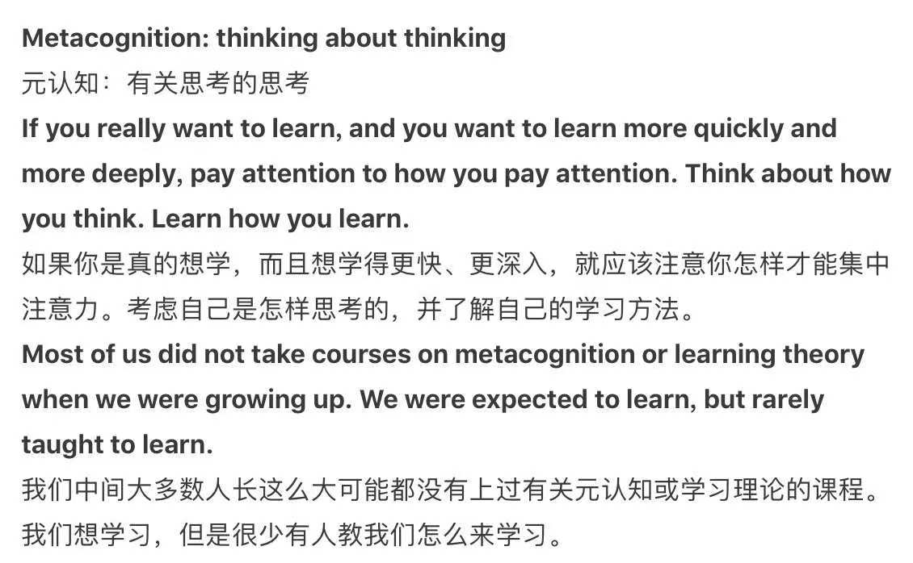

# 通关目录

## 知识清单

1. [**初中数学**](math/index.html)
2. [**初中物理**](physics/index.html)
3. [**初中化学**](chemistry/index.html)

## 学习方法

1. 学科分类：**人造与神造**。

   - “文科多做题，理科多看书。”

     参考：[徐晋如《理科白痴是怎样考上清华的》](https://blog.sina.com.cn/s/blog_3f6a436a0100cl5h.html)

   - “学人造的：多观察人类活动。”

     “学神造的：多观察自然存在。”
     
     参考：[邹恒明《操作系统之哲学原理》](img/人造与神造.jpg)

2. 复习方法：**框架回忆法**。

   - 目录法（一轮复习）：地毯式扫盲。（全方位，“集珍珠”）
   - 专题法（二轮复习）：重点式清障。（找关联，“串项链”）

   参考：[戚继光发明狼筅：自己创造，管用就好](https://www.bilibili.com/bangumi/play/ss28879)

3. 人工智能：**独学而无友**。

   参考：[DeepSeek](https://chat.deepseek.com/)

## 考试策略

1. [**考试策略**](strategy/index.html)（三轮复习）：考试是**时间管理**的艺术。

   参考：[为何公务员考试的题目很怪，有何实际意义吗？](https://www.zhihu.com/question/21693971/answer/3322928124)

## 拓展：对学习本身的思考

**在学习的过程中学习如何学习，在思考的过程中思考如何思考**。

 

任何事儿，要想做到你能感受到这件事儿的乐趣的程度，都需要一个学习成本（学习过程）。

最简单的，你想能够感受到唐诗宋词的美妙，至少还要学个汉语。一件事儿的乐趣，基本上都出现在你学会了它、掌握了它的方法之后，但很多人在那之前就已经因为种种理由中途放弃了。学习的过程往往是枯燥乏味的，天才就是那些在学习的过程中也能找到乐趣、感受到乐趣的人。这种乐趣是“学习”这件事儿本身的乐趣，因为他们学会了学习、掌握了学习的方法，完成了乐趣的衔接。

更天才的人则眼里没有苦难，他们总能在遇到的每一件事情上找到乐趣，学习有学习的乐趣，应用有应用的乐趣，教人有教人的乐趣，学、练、用、教、创，各有乐趣。失败了得教训，成功了得经验，他们完全是在体验人生，将刷经验值的效率拉满，而这种经验值的积累也会在假以时日的力量下，带领他们不断突破各种枷锁，最终成为常人难以望其项背的强者。

天才总能找到乐趣，而常人总能找到苦难，人与人之间的差别，在一开始仅在于思考问题方式的不同。

 

（完）
